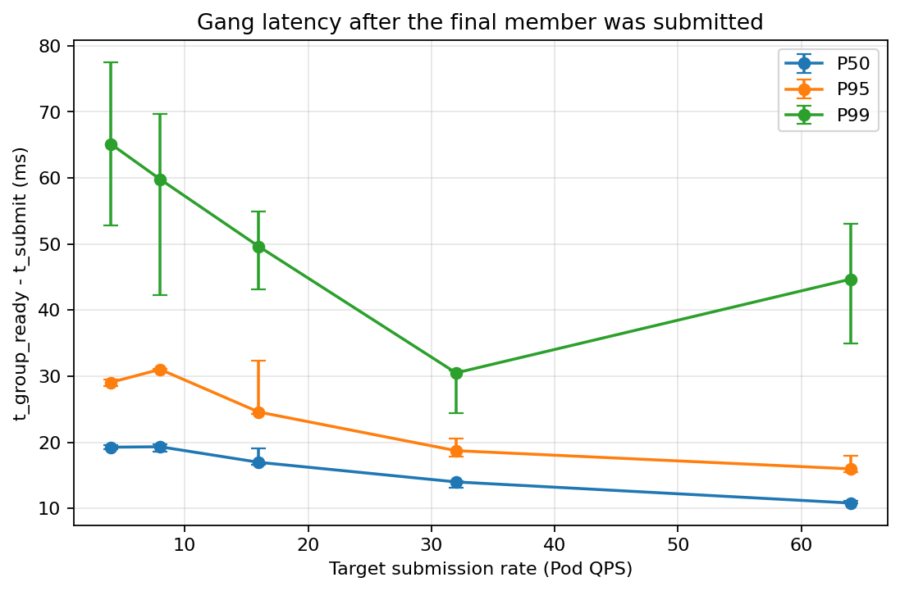

# GPU Fleet Scale Lab

**A Kubernetes control-plane scalability lab for AI/GPU fleets — simulate ~2,000 GPU nodes on one laptop, then measure where inference burst scale-out actually pressures the API server and scheduler.**

[](https://github.com/qiujiaro/gpu-fleet-scale-lab/actions/workflows/ci.yml)
Go · [kwok](https://kwok.sigs.k8s.io/) · client-go · Kubernetes Scheduling Framework · Prometheus

Large GPU fleets fail in ways you cannot see on a 3-node dev cluster: watch propagation lag, scheduler throughput collapse, API Priority & Fairness throttling, gang-scheduling deadlock under contention. Renting thousands of GPUs to find those failures is not an option for most engineers. This lab reproduces the *control-plane* half of the problem with kwok — real apiserver, real scheduler, real client-go, simulated nodes — so the scaling behaviour can be measured, plotted, and argued about with numbers.

Everything here is hand-written Go plus a measurement methodology designed to be falsifiable. **What is measured is labelled measured; what is not yet built is labelled todo.** See [Status](#status) — that honesty is the point of the project, not a caveat on it.

---

## Read first: what is real and what is simulated

| | |
| --- | --- |
| **Real** | kube-apiserver, etcd, kube-scheduler, controller-manager, client-go request path, watch/informer timing, Scheduling Framework plugin execution |
| **Simulated** | Nodes and kubelets (one `kwok-controller` stands in for thousands), GPUs as advertised `nvidia.com/gpu` capacity only |
| **Not present** | Container runtimes, image pulls, real GPUs, real networking, NVLink/IB topology (topology is a *label*, not a fabric) |

Consequences, stated up front rather than buried:

- **"Cold-start latency" is a configured kwok Pod-stage delay**, not a real image pull. It measures simulated delay + control-plane propagation.
- Single-machine scale tops out around **~1k nodes / ~100k pods** (kwok's own guidance). Anything beyond is discussed as *trend extrapolation*, never as a measurement.
- No simulated number is ever presented as real-hardware or production performance.

This boundary is restated in [docs/REPORT.md](docs/REPORT.md) next to every result.

---

## Results at a glance

Numbers below come from run CSVs under [experiments/](experiments), produced by the scripts in [scripts/](scripts) on a single laptop. The compact result figures are checked in; high-volume per-run artifacts may remain local.

### Exp1 — Fleet scale sweep (complete)

[`experiments/smoke-scale/smoke-scale-results.csv`](experiments/smoke-scale/smoke-scale-results.csv)

| Nodes added | Fleet size after | Time to all-Ready |
| --- | --- | --- |
| +100 | 1,100 | <1 s |
| +400 | 1,500 | 1 s |
| +500 | 2,000 | 3 s |

Each fake node advertises 64 CPU / 512 GiB / 8 GPUs with rack + zone topology labels ([node-template.yaml](config/kwok/node-template.yaml)).

**Result:** the lab brought a 2,000-node simulated GPU fleet to Ready on one laptop. This is a control-plane readiness result, not a claim about real kubelet, network, storage, or GPU initialization.

### Exp2 — TopoGang controlled-load sweep (complete)

The completed batch `exp2p-load-20260730-174540-96452` tested **4, 8, 16, 32, and 64 Pod/s**, three repeats per level, with 200 four-member gangs (800 Pods) per run. Of 15 attempted runs, one infrastructure-invalid run submitted zero Pods because the scheduler endpoint was unavailable; all **14 valid runs completed 800/800 Pods with zero censoring and zero gang rejection**.

| Target QPS | Valid repeats | Scheduling P95 | Gang P95 after final member submitted | Registry lock wait | Bind mean |
| ---: | ---: | ---: | ---: | ---: | ---: |
| 4 | 2 | 766.68 ms | 29.06 ms | 0.96 µs | 7.74 ms |
| 8 | 3 | 393.32 ms | 31.04 ms | 1.04 µs | 7.18 ms |
| 16 | 3 | 206.31 ms | 24.58 ms | 0.85 µs | 6.63 ms |
| 32 | 3 | 108.17 ms | 18.74 ms | 0.60 µs | 4.96 ms |
| 64 | 3 | 55.65 ms | 15.98 ms | 0.50 µs | 3.77 ms |

The falling Pod scheduling latency is explained by the four gang members arriving closer together as QPS increases (`3/QPS` expected submission span), not by the scheduler becoming faster under load. After removing that intentional arrival span, Gang P95 stayed within **15.98–31.04 ms**, and no tested level showed a saturation knee. PreFilter inspected one node per call and Registry lock wait remained around or below 1 µs, so this matrix did not expose the proposed whole-fleet scan or lock-contention bottlenecks.

The live capacity preview also reproduced the intended semantic difference under insufficient capacity: the default scheduler partially placed **3/4** members, while TopoGang placed **0/4**, leaving the incomplete group pending instead of partially occupying GPUs. See the full methodology and limitations in [the Exp2-P profiling note](docs/exp2p-gang-bottleneck-profiling.md) and the dated [Day 5 result log](docs/notes/logs/Day05.md).



### Instrument calibration and a rejected baseline

**Load-generator calibration** — [`experiments/day2-client-preflight/summary.csv`](experiments/day2-client-preflight/summary.csv)

Against a 1,000-node cluster: 50 target QPS for 60 s → **2,860 pods attempted, 2,860 succeeded, 0 failed, 0 client-side rate-limited, 47.7 QPS sustained.** This run exists to prove a negative — that the *measuring instrument* is not the bottleneck — before any scaling claim is made with it. client-go's default QPS/burst throttles at 5 QPS and would otherwise have been silently mistaken for apiserver saturation.

**A measurement bug the pipeline caught on itself** — [`experiments/exp1-scale-sweep/N100-summary.csv`](experiments/exp1-scale-sweep/N100-summary.csv), [Day 3 log](docs/notes/logs/Day03.md)

The first Exp1 baseline (N=100, 30 QPS, 120 s, 3,498 pods) returned **3 valid scheduling samples out of 3,498** and a 52.9% censored rate. That is the *correct* output, not a crash: `scheduled` is taken from the server-side `PodScheduled` `LastTransitionTime`, which has **one-second granularity**, while scheduling under kwok completes in milliseconds — so the subtraction goes negative for most pods. Because `Summarize` **drops negative durations and logs them rather than clamping or `abs()`-ing them**, the precision problem surfaced as a visibly broken sample count instead of a plausible-looking P99 that was quietly wrong.

The N=500 point was deliberately *not* run until the clock source is fixed — a second dataset built on the same defect is worse than no dataset. Fix in progress: measure `scheduled` from the client-side first observation of `spec.nodeName`, keep the server-side condition as the propagation cross-check, and state which clock each phase uses.

---

## Core modules (hand-written Go)

| Module | What it does | State |
| --- | --- | --- |
| **[Load generator](pkg/loadgen)** | constant / Poisson / burst arrival models, token-bucket pacing, worker pool, 429-aware retry, JSONL lifecycle recorder | implemented, unit-tested |
| **[Latency profiler](pkg/profiler)** | watch-based four-moment timeline (UID-keyed, first-write-wins, concurrent-safe), submit→scheduled→bound→ready phase split, UID join with right-censoring, nearest-rank quantiles, PromQL cross-check | implemented end-to-end; clock-source fix in flight (see above) |
| **[Second scheduler + TopoGang plugin](pkg/scheduler/plugins/topogang)** | a real out-of-tree kube-scheduler binary (`app.NewSchedulerCommand` + `WithPlugin`) with whole-group GPU PreFilter admission, per-node Filter, NVLink-domain Score, Pod-UID Reserve/Unreserve, and Permit Wait/Allow/Reject | implemented, race-tested, and exercised end to end against live KWOK workloads |
| **[Figure pipeline](analysis/plot.py)** | 8 report figures generated from run CSVs; a figure with no input data is *skipped with a printed reason* rather than drawn from placeholders | implemented |

The custom scheduler inherits the real scheduler queue, snapshot, scheduling/binding machinery, leader election, and metrics on `:10259`, and contributes one out-of-tree plugin. Day 4 first established a deliberately neutral skeleton and used [`scripts/day4-two-schedulers.sh`](scripts/day4-two-schedulers.sh) to assert that the second scheduler did not interfere with the default one. Day 5 replaced that skeleton with the TopoGang algorithm: PreFilter performs an advisory whole-group GPU fit check, Score prefers NVLink domains containing more members of the same gang, Reserve tracks idempotent Pod-UID placements, and Permit holds binding until `minMember` is reached or rejects the attempt at a shared deadline. The implementation, live validation, controlled-load results, and remaining scale limits are documented in the [Day 5 engineering log](docs/notes/logs/Day05.md).

`go build ./... && go test ./...` is green; `go vet`, build, and tests run on every push and PR via [GitHub Actions](.github/workflows/ci.yml). Large-scale experiments are deliberately **not** in the PR gate — CI runners are too noisy for SLO assertions.

---

## Measurement methodology

The methodology is fixed before the numbers exist, so results cannot be reverse-engineered into a nicer story. Full version in [docs/REPORT.md](docs/REPORT.md); the rules that matter:

- **≥3 repeats per configuration**, plotted as mean with min/max whiskers. Single-run values are never reported.
- **Control variables travel with the data.** Every run writes `<run>-meta.json` (nodes, QPS, scheduler, optimize flag, seed, durations); the plotter reads control variables from there and warns loudly if it has to fall back to parsing a filename.
- **Nearest-rank quantiles** on the raw sample ([quantile.go](pkg/profiler/quantile.go)) — no interpolation, no histogram bucketing. Client-side quantiles are compared against server-side `histogram_quantile` on `apiserver_request_duration_seconds`, and reported side by side, never averaged: they measure different things.
- **Censored samples are counted, not dropped silently.** Every quantile reads "P99 = X ms over n of N pods"; a censored rate above a few percent invalidates the tail and the run is repeated with a longer drain instead of published.
- **Mixed clocks are declared.** `scheduled` uses the server-side `PodScheduled` `LastTransitionTime`; `bound` uses the client's observation of `spec.nodeName` — so the binding phase spans two clocks, and that is stated wherever it is used.
- **Stacked breakdowns stack medians, not P99s.** Quantiles are not additive; a stacked P99 would show a total no pod ever experienced.

## Experiment status

| | Question | Status |
| --- | --- | --- |
| **Exp1** Fleet scale | Can the local KWOK control plane bring a simulated GPU fleet to 2,000 Ready nodes, and how does readiness time change? | ✅ complete — 2,000 nodes Ready; final +500 step took 3 s |
| **Exp2** TopoGang behavior and load | Does TopoGang prevent partial gang placement, and where does its scheduler path bottleneck as offered load rises? | ✅ complete — behavior preview plus 4–64 QPS controlled sweep; no saturation knee observed |
| **Exp3** Burst scale-out | Where does an inference burst hit API Priority & Fairness, and how much does batched binding / cold-start tuning recover? | planned follow-up |

---

## Status

Ten-day build, run in the open with a dated engineering log per day ([docs/notes/logs](docs/notes/logs)) recording what was tried, what broke, and what was learned — including the mistakes.

| Day | Focus | Status |
| --- | --- | --- |
| 1 | kwok cluster, fake GPU node pool, SLO baseline | ✅ 2,000 nodes Ready in 3 s |
| 2 | Load generator (client-go, rate-controlled) | ✅ implemented + calibrated at 50 QPS |
| 3 | Latency profiler + baseline sweep | ✅ profiler implemented; invalid timestamp baseline detected and rejected rather than published |
| 4 | Out-of-tree second scheduler | ✅ custom scheduler binary + profile + two-scheduler non-interference script ([design log](docs/notes/logs/day4-scheduler.md)) |
| 5 | TopoGang PreFilter / Filter / Score / Reserve / Permit | ✅ core implemented, race-tested, and validated against live KWOK workloads ([results](docs/notes/logs/Day05.md)) |
| 6 | Instrumentation and repeatable harness | ✅ per-run scheduler deltas, gang timelines, validity gates, and automated analysis |
| 7 | Exp1 fleet sweep + Exp2 TopoGang sweep | ✅ completed; results and limitations reported above |
| 8 | Exp3 burst scale-out + APF pressure | planned follow-up |
| 9 | Figures and report | ✅ Exp2 figures generated from run CSVs; generic figure pipeline retained |
| 10 | Demo and upstream follow-up | planned |

## Quickstart

```bash
go build ./... && go test ./...     # green
go test -race ./pkg/scheduler/plugins/topogang

# 1) simulated fleet
kwokctl create cluster --name gpu-scale --runtime docker --prometheus-port 9090
./scripts/spawn-nodes.sh 1000       # 1000 fake 8-GPU nodes
./scripts/smoke-scale.sh            # add up to +1000 more, record time-to-all-Ready per step

# 2) prove the client is not the bottleneck
make preflight-day2                 # 50 QPS / 60 s calibration

# 3) generate load and profile it
go run ./cmd/loadgen  --help
go run ./cmd/profiler --help

make figures                        # rebuild all figures from experiments/*.csv

# 4) run the custom scheduler beside the default one
go run ./cmd/scheduler --config config/scheduler/topogang-config.yaml \
  --kubeconfig ~/.kube/config -v=4
./scripts/day4-two-schedulers.sh    # same workload to both, check non-interference
```

## Repository layout

```
cmd/{loadgen,profiler,scheduler}   entrypoints
pkg/loadgen                        arrival models, token bucket, retry, recorder
pkg/profiler                       watch, timeline, join, quantiles, PromQL, report
pkg/scheduler/plugins/topogang     Scheduling Framework plugin (topology + gang)
config/kwok                        fake GPU node template
scripts/                           cluster spin-up, scale smoke, calibration, demo
experiments/                       raw JSONL + summary CSV per run (committed)
analysis/plot.py                   CSV → figures, no hard-coded numbers
docs/REPORT.md                     methodology and results
docs/notes/logs/                   daily engineering log
```

## References

kwok · Kubernetes SIG Scalability SLOs · Scheduling Framework · [kubernetes-sigs/scheduler-plugins](https://github.com/kubernetes-sigs/scheduler-plugins) · API Priority & Fairness.
