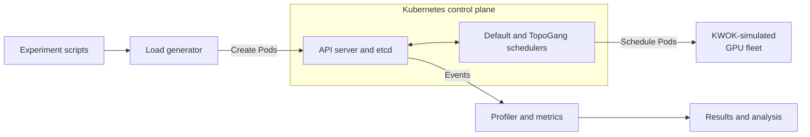
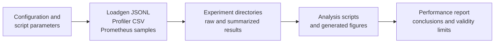

# Architecture

GPU Fleet Scale Lab is a local Kubernetes control-plane testbed. It keeps the
Kubernetes API server, etcd, controllers, schedulers, and client request/watch paths
real, while KWOK simulates nodes, kubelets, GPU capacity, and optional cold-start
transitions.

The architecture is designed to answer control-plane scaling questions without
requiring a physical GPU fleet. It does not model GPU execution, container image pulls,
CNI, storage, or accelerator fabrics such as NVLink and InfiniBand.

## System overview

Pods are dispatched by `spec.schedulerName`, so the default and custom schedulers can
run side by side without competing for the same Pod. The API server and etcd remain the
shared control-plane path under test.

## Runtime components

### Load generator

[`cmd/loadgen`](../cmd/loadgen) is the CLI adapter and Kubernetes client. The reusable
logic in [`pkg/loadgen`](../pkg/loadgen) provides:

- constant, Poisson, and burst arrival models;
- token-bucket rate and burst control;
- concurrent submission workers and bounded retries for HTTP 429 responses;
- deterministic gang labels and member indexes; and
- a JSONL submission log containing the client-side submission timestamp.

The load generator creates `pause` Pods with an `nvidia.com/gpu` request. Runs may target
either `default-scheduler` or the `topogang` scheduler profile.

### Profiler

[`cmd/profiler`](../cmd/profiler) configures the Kubernetes client and writes reports.
[`pkg/profiler`](../pkg/profiler) owns the measurement path:

1. Start a label-filtered Pod informer before submission begins.
2. Record observed created, scheduled, bound, and ready states.
3. Join observations to the load generator's JSONL by Pod identity.
4. Preserve incomplete observations as censored samples instead of silently dropping
   them.
5. Emit per-Pod and per-gang timelines plus P50/P95/P99 summaries.

The profiler can also query Prometheus for a server-side API latency cross-check.

### Custom scheduler

[`cmd/scheduler`](../cmd/scheduler) embeds the Kubernetes v1.30 scheduler command and
registers out-of-tree plugins. Kubernetes still owns configuration parsing, informers,
the scheduling queue, scheduling cycles, binding cycles, and leader election.

The main plugin is
[`TopoGang`](../pkg/scheduler/plugins/topogang), which implements these Scheduling
Framework extension points:

| Extension point | Responsibility |
| --- | --- |
| `PreFilter` | Parse gang metadata, record per-cycle state, and check whole-group GPU capacity against the scheduler snapshot |
| `Filter` | Reject nodes that cannot satisfy the Pod's GPU request |
| `Score` / `NormalizeScore` | Prefer nodes in a suitable configured topology domain |
| `Reserve` / `Unreserve` | Maintain idempotent cross-Pod gang reservation state |
| `Permit` | Hold members at a barrier until the gang is complete, or reject it on timeout |

Gang state is stored in a mutex-protected registry on the plugin instance because
`CycleState` lasts for only one Pod scheduling cycle. The whole-group capacity check is
advisory: scheduler snapshots can change concurrently, while the `Permit` barrier is the
mechanism that enforces group release behavior.

[`CoalescedBind`](../pkg/scheduler/plugins/coalescedbind) is an optional experimental
plugin registered in the same binary for binding-path experiments. Which plugins run is
controlled by the selected file in [`config/scheduler`](../config/scheduler), not merely
by registration in the binary.

## Simulation layer

[`config/kwok`](../config/kwok) defines the simulated fleet:

- the node template advertises GPU resources and topology labels; and
- the optional Pod stage configuration simulates cold-start lifecycle delay.

KWOK replaces node and kubelet behavior only. Requests, watches, persistence, scheduling,
and controller reactions still pass through the real Kubernetes control plane.

## Experiment and data flow

[`scripts`](../scripts) orchestrates cluster setup and the Exp0–Exp3 workflows. Each run
combines configuration, raw observations, and analysis in this direction:

The experiment directories are evidence, not runtime dependencies. See the
[experiment catalog](experiments/CATALOG.md) for canonical names and data locations.

## Configuration boundaries

| Location | Controls |
| --- | --- |
| [`config/kwok`](../config/kwok) | Simulated node resources, topology, and lifecycle stages |
| [`config/scheduler`](../config/scheduler) | Scheduler profiles, enabled extension points, plugin arguments, and experimental variants |
| [`config/workloads`](../config/workloads) | Reserved location for reusable workload definitions |
| CLI flags and scripts | Arrival rate, duration, gang size, scheduler target, output paths, and run identity |

The scheduler plugin name (`TopoGang`) and scheduler profile name (`topogang`) are
different identifiers. Plugin registration, enabled extension points, plugin config,
and the Pod's `spec.schedulerName` must agree with their respective configuration roles.

## Design constraints

- Measurements characterize this simulated local control plane, not production GPU or
  data-plane performance.
- The profiler must start before the load generator; otherwise early events are missed
  and latency is biased downward.
- A run-specific label selector prevents Pods from older runs contaminating results.
- Kubernetes dependencies are pinned together at v1.30/v0.30 because the scheduler
  framework is imported from the Kubernetes staging modules and its interfaces change
  across releases.
- Output is deliberately file based (JSONL and CSV) so raw evidence remains inspectable
  and analysis can be reproduced independently of the running cluster.

For operating instructions, see the [Start Guide](START.md). For measured results and
methodology, see the [Performance & Scalability Report](REPORT.md).
