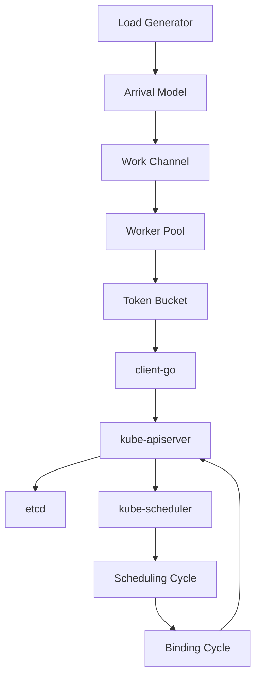
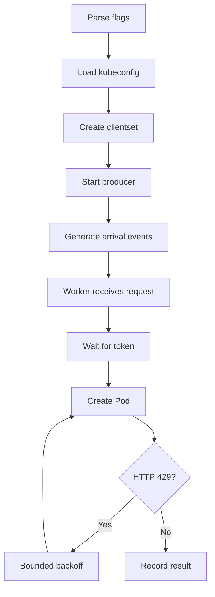

# Day 02 — Exp0 Load Generator and Client Calibration (`client-go`)

- **Date:** 2026-07-23
- **Time spent:** ~1 day
- **Core module:** Load Generator
- **Target:** 1000-node KWOK cluster

## Goals

- [x] Stand up a client-go program that creates Pods at a controlled rate (QPS/burst).
- [ ] Record per-Pod lifecycle timestamps (created / scheduled / bound / ready).
- [x] Verify the generator does not itself become the bottleneck at 50 target QPS.


## Request path



## Component roles

| Component | Role |
|---|---|
| Load generator | API request producer |
| `client-go` | Kubernetes Go client library |
| `clientset` | Typed Kubernetes client object |
| kube-apiserver | Receives and validates API requests |
| etcd | Persists Kubernetes objects |
| kube-scheduler | Selects a Node for each unscheduled Pod |
| KWOK | Simulates Nodes and kubelet behavior |

### Client vs server

```text
loadgen/client-go  →  kube-apiserver
      client              server

kube-scheduler     →  kube-apiserver
      client              server

kube-apiserver     →  etcd
      client             server
```

`client` / `server` are communication roles, not fixed machines.

## Scheduler path

| Stage | Purpose |
|---|---|
| Scheduling cycle | Filter and score Nodes; choose one Node |
| Binding cycle | Reserve, permit, and commit Pod → Node |
| Result | `Pod.spec.nodeName` becomes non-empty |

Pod scheduler field:

```yaml
spec:
  schedulerName: default-scheduler
```

## Arrival models

| Model | Inter-arrival time | Load shape | Expected tail latency |
|---|---|---|---|
| Constant | Fixed: `1 / λ` | Smooth | Lower |
| Poisson | `-ln(U) / λ` | Random clustering | Higher |
| Burst | Requests submitted in groups | Explicit spikes | Highest under saturation |

At equal average QPS:

- Constant: stable queue depth
- Poisson: short random bursts
- Burst: intentional pressure spikes
- Higher arrival variance → more queueing → higher p95/p99
- Difference grows as utilization approaches capacity

## Client-side rate limiting

### `rest.Config`

| Setting | Default | Meaning |
|---|---:|---|
| `QPS` | 5 | Long-term token refill rate |
| `Burst` | 10 | Maximum stored tokens / immediate burst |
| `RateLimiter` | `nil` | Custom limiter; overrides QPS/Burst |

```text
QPS     = token refill rate
Burst   = bucket capacity
1 API request = 1 token
```

If target QPS is higher than the client limit:

```text
Target: 50 QPS
    ↓
client-go default: 5 QPS
    ↓
API Server receives only ~5 QPS
```

Result: client becomes the bottleneck before the cluster.

Calibration configuration must satisfy:

```text
client limit > workload target
```

The workload generator controls experimental arrival rate; client-side limiting prevents accidental overload.

## Hand-written `TokenBucket`

```go
type TokenBucket struct {
    mu sync.Mutex

    tokens   float64
    capacity float64
    rate     float64
    last     time.Time
}
```

| Field | Purpose |
|---|---|
| `tokens` | Current request permits |
| `capacity` | Maximum token count / burst |
| `rate` | Tokens added per second |
| `last` | Last refill calculation |
| `mu` | Protects shared mutable state |

### `Wait`

```go
func (b *TokenBucket) Wait(ctx context.Context) error
```

`Wait` is a method, not a channel.

```text
Wait()
  ├─ context cancelled → return error
  ├─ refill tokens
  ├─ token available → consume one → return nil
  └─ no token → timer wait → retry
```

Channels used internally:

| Channel | Meaning |
|---|---|
| `timer.C` | Calculated wait completed |
| `ctx.Done()` | Operation cancelled or timed out |

### `refill`

```go
func (b *TokenBucket) refill(now time.Time)
```

Formula:

```text
elapsed = now - last
new tokens = elapsed × rate
tokens = min(tokens + new tokens, capacity)
```

`refill` is package-private because its name starts with lowercase.

### Go method receiver

```go
func (b *TokenBucket) Wait(...)
func (b *TokenBucket) refill(...)
```

`(b *TokenBucket)` identifies both as `TokenBucket` methods.

- `b`: receiver variable
- `*TokenBucket`: pointer receiver
- Pointer required to update the original bucket
- Avoids copying `sync.Mutex`

### Why mutex is required

Multiple workers share one bucket:

```text
Worker A ─┐
Worker B ─┼─→ same tokens / last state
Worker C ─┘
```

Mutex protects this critical section:

```text
refill → check token → consume token → update last
```

Without it:

- One token may release multiple workers
- The same elapsed time may be refilled multiple times
- `tokens` and `last` may have data races

The mutex is released before timer waiting so other workers can continue.

## Implementation

### Package layout

```text
cmd/loadgen/
└── main.go

pkg/loadgen/
├── arrival.go
├── token_bucket.go
├── retry.go
├── recorder.go
├── run.go
└── spec.go
```

### Main workflow



### Pod submission

```go
cs.CoreV1().
    Pods(namespace).
    Create(ctx, pod, metav1.CreateOptions{})
```

GPU resources require equal request and limit values:

```yaml
resources:
  requests:
    nvidia.com/gpu: "1"
  limits:
    nvidia.com/gpu: "1"
```

Extended resources such as `nvidia.com/gpu` cannot be overcommitted.

## JSONL output

One record per accepted Pod:

```json
{
  "uid": "pod-uid",
  "name": "loadgen-000001",
  "submit_ts": "2026-07-23T12:00:00.123Z"
}
```

Current timestamp meaning:

| Timestamp | Status |
|---|---|
| `submit_ts` / created | Implemented |
| scheduled | Pending profiler |
| bound | Pending profiler |
| ready | Pending profiler |

## Exp0 client calibration preflight

### Command

```bash
make exp0-loadgen-calibration
```

Equivalent workload:

```bash
go run ./cmd/loadgen \
  --kubeconfig ~/.kube/config \
  --arrival constant \
  --qps 50 \
  --duration 60s \
  --gpu 1 \
  --scheduler-name default-scheduler \
  --out experiments/exp0-loadgen/client-preflight/run.jsonl
```

### Environment

| Item | Value |
|---|---:|
| Ready Nodes | 1000 |
| Arrival model | Constant |
| Target QPS | 50 |
| Duration | 60 s |
| Client burst | 50 |
| Pass floor | 47.5 QPS |
| Allowed failures | 0 |
| Allowed HTTP 429 | 0 |

## Results

| Result | Nodes | Target QPS | Attempted | Succeeded | Failed | 429 | Actual QPS |
|---|---:|---:|---:|---:|---:|---:|---:|
| PASS | 1000/1000 | 50 | 2860 | 2860 | 0 | 0 | 47.67 |

Interpretation:

- Throughput above 47.5-QPS acceptance floor
- No failed submissions
- No API-server throttling
- Client suitable for Exp3 baseline
- 47.67 QPS close to threshold; repeat runs required

## Problems and fixes

| Problem | Root cause | Fix |
|---|---|---|
| 2000 Ready Nodes | Two simulated Node sets accumulated | Removed unintended `node-*` set |
| Bash `unbound variable` | macOS Bash 3.2 + empty array + `set -u` | Removed optional empty arrays |
| Kubeconfig not found | Empty flag triggered in-cluster configuration | Fall back to `KUBECONFIG` or `~/.kube/config` |
| All Pod creates failed | GPU request had no matching limit | Set equal GPU request and limit |
| Duplicate submission | Direct submission plus retry submission | Consolidated into retry path |
| Incomplete shutdown | Workers were not awaited | Added `WaitGroup` |
| Unsafe statistics | Concurrent writes | Added atomic counters |
| Recorder mismatch | Wrong record type | Added typed JSONL record |
| `ErrNotImplemented` | Placeholder return | Return actual execution result |

## Key takeaways

- `client-go` sends Kubernetes API requests; shell scripts only orchestrate experiments.
- `CoreV1()` exposes typed clients for Pods, Nodes, Services, etc.
- Producer controls arrivals; workers execute submissions.
- Token bucket controls aggregate client-side rate.
- HTTP 429 originates from server-side throttling and requires separate accounting.
- Slow `Create()` may include client token wait, network, apiserver processing, and etcd write.
- Pod creation success does not mean scheduling completion.
- KWOK validates control-plane behavior, not physical GPU or container startup performance.

## Open questions

- [ ] Replace relative constant timers with absolute deadlines or ticker
- [ ] Explain 47.67 vs 50 target QPS
- [ ] Repeat baseline and report mean / variance
- [ ] Add scheduled / bound / ready profiler
- [ ] Separate client throttle time from API response latency
- [ ] Create controlled APF/429 pressure experiment

## Artifacts

- `scripts/exp0-loadgen-calibration.sh`
- `experiments/exp0-loadgen/client-preflight/run.jsonl`
- `experiments/exp0-loadgen/client-preflight/loadgen.log`
- `experiments/exp0-loadgen/client-preflight/summary.csv`
- `pkg/loadgen/{arrival,token_bucket,retry,recorder,run,spec}.go`

## Next steps

- [ ] Token-bucket refill and cancellation tests
- [ ] HTTP 429 retry-limit tests
- [ ] Recorder concurrency tests
- [ ] Worker shutdown tests
- [ ] Multi-run baseline
- [ ] Lifecycle timestamp profiler
- [ ] Burst and APF pressure experiments

> **Correction:** HTTP 429 usually shows that requests reached the API Server and triggered server-side flow control. Client-side limiter behavior should be verified using limiter wait time, achieved send rate, or unit tests.
