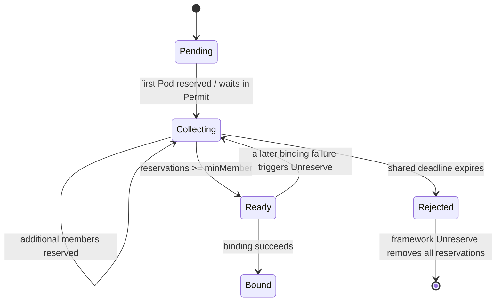

# Day 05 — Topology-Aware Gang Scheduling Plugin

- **Date:** 2026-07-27
- **Planned deliverable:** A working TopoGang scheduler plugin with whole-group admission, topology-aware scoring, and a Permit barrier.
- **Core module:** `pkg/scheduler/plugins/topogang`
- **Status:** Core implementation complete; framework-level Permit integration and KWOK comparison experiment remain.

## Goals

- [x] Understand the scheduler framework extension points used by TopoGang.
- [x] Implement PreFilter gang membership and whole-group GPU capacity checks.
- [x] Implement per-node GPU filtering.
- [x] Implement topology-aware Score and score normalization.
- [x] Implement idempotent Reserve/Unreserve bookkeeping.
- [x] Implement Permit Wait/Allow and group timeout rejection.
- [x] Protect cross-Pod state against concurrent binding cycles.
- [x] Run package tests with the Go race detector.
- [ ] Exercise the real framework waiting-pod map in an integration-style test.
- [ ] Run the KWOK default-scheduler versus TopoGang comparison.
- [ ] Verify timeout, Unreserve, and requeue behavior from scheduler and Pod events.

## Concepts I Clarified

### Grove and gang scheduling

Grove is a Kubernetes orchestration system for distributed AI inference workloads. Gang scheduling is one of its core capabilities, but Grove also addresses hierarchical gangs, topology-aware placement, coordinated scaling, startup ordering, and workload lifecycle management.

This project implements a deliberately smaller idea:

```text
Pod labels + minMember + topology Score + Permit Wait/Allow/Reject
```

It does not implement Grove's hierarchical workload model or production lifecycle controllers.

### Pod, Node, and metadata

`v1.Pod` and `v1.Node` are the Go representations of Kubernetes API objects. `ObjectMeta` is embedded in both types, which is why fields such as the following can be accessed directly:

```text
pod.Labels
pod.Namespace
pod.UID
node.Labels
```

The fake Node YAML must follow the `core/v1 Node` API shape. Its important inputs to this plugin are:

```text
status.allocatable["nvidia.com/gpu"]
metadata.labels["topology.nvidia.com/nvlink-domain"]
```

The `nvidia.com/gpu.count` label is only metadata. The scheduler performs resource accounting with `status.allocatable["nvidia.com/gpu"]`.

The repository maintains one parameterized Node template. `scripts/spawn-nodes.sh` replaces the node, domain, and zone placeholders and submits the generated Nodes to the API server for KWOK to simulate.

### CycleState, PreFilterState, and Registry

These structures have different scopes:

| Structure | Scope | Purpose |
| --- | --- | --- |
| `framework.CycleState` | One Pod, one scheduling attempt | Framework-owned temporary storage shared between extension points |
| `PreFilterState` | One TopoGang Pod, one scheduling attempt | Stores the parsed group UID, `minMember`, and the Pod GPU request |
| `Registry` | All Pods handled by one TopoGang plugin instance | Stores cross-Pod gang reservations, topology placement, deadline, and state |

The simplest mental model is:

```text
PreFilterState describes "this Pod".
Registry describes "the whole gang".
CycleState is the temporary container holding this Pod's state.
```

`CycleState` cannot store the gang's reservation count because every Pod has a different CycleState. The plugin-level Registry is required for members of the same gang to observe one another.

### Filter does not allocate GPUs

Filter only answers whether the current Pod can fit on one candidate node:

```text
free GPU = allocatable GPU - requested GPU
free GPU >= current Pod GPU request
```

Filter does not mutate NodeInfo, allocate a physical GPU, or create a gang reservation. The kube-scheduler cache performs assumed-resource accounting after selecting a node. TopoGang's Reserve hook separately records gang membership and topology placement.

Pods in one gang do not share one GPU. Each Pod requests and occupies its own GPU resources. Gang scheduling coordinates admission so enough members receive their own resources before the workload is released.

## Design

### Scheduling flow

```text
PreFilter
  Parse and validate gang labels
  Compute this Pod's GPU request
  Store PreFilterState in CycleState
  Check whether the gang can plausibly reach minMember
        |
        v
Filter(candidate node)
  Check this Pod's GPU request against NodeInfo
        |
        v
Score(candidate node)
  Read how many group members are already in the node's NVLink domain
        |
        v
NormalizeScore
  Map raw placement counts to [0, 100]
        |
        v
Scheduler chooses and assumes a node
        |
        v
Reserve
  Add a Pod-UID-keyed reservation to the Registry
        |
        v
Permit
  reserved < minMember  -> Wait
  reserved >= minMember -> Allow waiting siblings
  deadline reached      -> Reject the group
        |
        v
Unreserve on failure
  Remove the reservation idempotently
```

### Topology is a soft preference

The current implementation does not hard-lock a gang to the first observed NVLink domain. A hard constraint would require PreFilter to prove that one domain can hold the entire group and would need a domain-selection and fallback protocol.

Instead:

```text
Filter: enforce per-Pod capacity only
Score: prefer domains containing more members of the same gang
```

This preserves schedulability when one domain cannot contain the entire gang.

### Whole-group capacity check

PreFilter reads the scheduler's NodeInfo snapshot:

```text
NodeInfo.Allocatable.ScalarResources["nvidia.com/gpu"]
NodeInfo.Requested.ScalarResources["nvidia.com/gpu"]
```

`Requested` includes assumed Pods, which prevents double booking.

The check is shape-aware rather than using only aggregate free GPUs:

```text
members fitting on a node = free GPU on node / GPU request per Pod
```

This catches fragmentation such as two nodes with one free GPU each when every Pod requires two GPUs.

The result remains advisory because the snapshot can become stale and capacity alone does not prove that affinity, volumes, taints, or every other scheduling constraint can be satisfied.

### Pod-level reservations

The first design used only an integer `Assigned` count. That cannot make Unreserve idempotent: releasing the same Pod twice could incorrectly decrement another member's count.

The corrected source of truth is:

```text
map[types.UID]PodReservation
```

Each record stores:

```text
Pod UID
node name
topology domain
reservation timestamp
```

The assigned member count is always `len(Reservations)`. Domain data is stored at Reserve time so Unreserve does not need to look up a Node that may have been deleted or relabeled.

Important invariants:

```text
One Pod UID has at most one reservation.
A duplicate identical Reserve is a no-op.
Unreserve of a missing Pod UID is a no-op.
Framework Allow/Reject callbacks are invoked without holding the Registry mutex.
```

### Permit and timeout behavior

Returning `Wait` does not block the main scheduling loop. It parks only the current Pod's binding while the scheduler continues processing other Pods.

When the `minMember`-th reservation reaches Permit, the plugin iterates over framework waiting Pods, selects siblings with the same namespace-qualified group UID, and calls `Allow(TopoGang)`.

The whole group shares one deadline. Only one waiter starts the timer. On expiration, the plugin marks the attempt Rejected and rejects all waiting siblings so the framework can invoke Unreserve.

`AttemptID` prevents an old timer from rejecting a newly created attempt that reuses the same group name.

### Ordinary non-gang Pods

In Kubernetes v1.30, a PreFilter `Skip` suppresses the coupled Filter and PreFilterExtensions, but it does not automatically suppress Score, Reserve, or Permit.

Therefore those extension points explicitly recognize ordinary non-gang Pods and return neutral success. A missing PreFilterState for a real gang Pod remains an internal error.

## Core Responsibility of Each Function

| Function | Most important responsibility |
| --- | --- |
| `New` | Parse configuration and construct one plugin instance with one shared Registry |
| `PreFilter` | Decide whether the gang can plausibly reach `minMember` before expensive node evaluation |
| `Filter` | Decide whether this Pod has enough GPU capacity on this candidate node |
| `Score` | Read the number of same-group placements in the candidate node's topology domain |
| `NormalizeScore` | Convert raw domain counts to the framework's legal `[0,100]` range |
| `Reserve` | Add one idempotent Pod-UID reservation after the scheduler has selected a node |
| `Unreserve` | Roll back that exact Pod reservation on any later failure |
| `Permit` | Enforce the `minMember` barrier with Wait, Allow, and timeout rejection |
| `Ensure` | Atomically find or create one group and reject conflicting `minMember` declarations |
| `Assign` | Record one distinct reserved Pod and update its domain count |
| `Release` | Remove one reservation using its stored domain information |
| `PlacedInDomain` | Return Score's topology-locality signal under the Registry lock |
| `DecidePermit` | Atomically choose Ready, Wait, or Rejected from current gang state |
| `RejectIfCollecting` | Reject only the still-collecting attempt that owns the expired timer |

## Implementation Completed

- Added validated `TopoGangArgs`:
  - `permitTimeout`
  - `topologyKey`
  - `gpuResourceName`
- Added strict PodGroup label parsing.
- Added namespace-qualified group UIDs.
- Added `PreFilterState` with `framework.StateData.Clone`.
- Added GPU request calculation for regular and init containers.
- Added shape-aware whole-group GPU capacity checking.
- Added per-node GPU Filter.
- Added topology-aware raw Score.
- Added NormalizeScore.
- Added Pod-UID-keyed reservations.
- Added idempotent Reserve/Unreserve.
- Added Registry-level Permit decisions.
- Added group deadline and stale-timer protection.
- Added waiting-group Allow and Reject operations.
- Kept ordinary Pods neutral across all enabled extension points.

## Tests and Validation

Completed:

```text
go test -race ./pkg/scheduler/plugins/topogang
go test ./pkg/...
go test ./cmd/scheduler
```

All completed successfully.

The tests currently cover:

- plugin argument defaults, decoding, and validation;
- non-gang Pod behavior;
- PodGroup label parsing and `minMember` validation;
- shape-aware GPU capacity checks;
- per-node GPU Filter success and rejection;
- concurrent Registry singleton creation;
- duplicate Reserve and repeated Unreserve idempotency;
- score normalization;
- Registry Permit Wait/Ready decisions;
- expired-group rejection;
- race detection for the exercised concurrent paths.

## What I Learned

- Filter can be individually cheap but becomes expensive when multiplied by thousands of candidate nodes.
- PreFilter is useful both for early rejection and for computing data once for later extension points.
- Scheduler cache assumption and plugin reservation are separate concepts:
  - scheduler cache assumption protects resource accounting;
  - TopoGang reservation tracks gang membership and topology.
- Permit Wait is asynchronous with respect to the main scheduling loop.
- A timeout for one waiting Pod is not automatically a whole-gang rejection.
- A count alone is insufficient for idempotent rollback; reservations need Pod identity.
- Returning internal pointers after releasing a Registry lock invites races, so extension points should consume immutable snapshots.
- The race detector checks only concurrency paths that tests actually execute; passing `-race` is evidence, not a proof of all possible correctness.

## Known Limitations

- The whole-group PreFilter model currently covers GPU capacity only.
- It assumes gang members have the same GPU request as the currently scheduled Pod.
- CPU, memory, taints, affinities, volumes, and other constraints are enforced per Pod by default scheduler plugins.
- Topology is a soft preference, not a hard all-members-in-one-domain guarantee.
- Permit provides a barrier, not transactional atomic binding; individual Bind operations may still fail after release.
- Successful bindings and terminated Pods are not yet removed through PostBind or informer-based lifecycle cleanup.
- The Registry is in memory and is lost when the scheduler process restarts.
- The current timeout tests validate Registry decisions but do not yet exercise the real framework waiting-pod map and full Unreserve/requeue path.

## Remaining Day 5 Work

- [ ] Build an integration-style framework test that exercises the real waiting-pod map.
- [ ] Prove that the `minMember`-th Pod releases earlier waiting siblings.
- [ ] Prove that group timeout rejects siblings and drives all reservations back to zero.
- [ ] Run a KWOK scenario with `minMember=4`, one GPU per Pod, and capacity for only three members.
- [ ] Compare default scheduler partial placement with TopoGang whole-group waiting/failure.
- [ ] Capture Pod events, scheduler logs, and observed timeout/requeue behavior.

## State Machine



## Plan for Day 6

First finish the real Permit and KWOK integration checks so Day 5 has evidence for all-or-nothing behavior. Then proceed to cold-start simulation and batching work without treating unverified scheduler behavior as complete.
