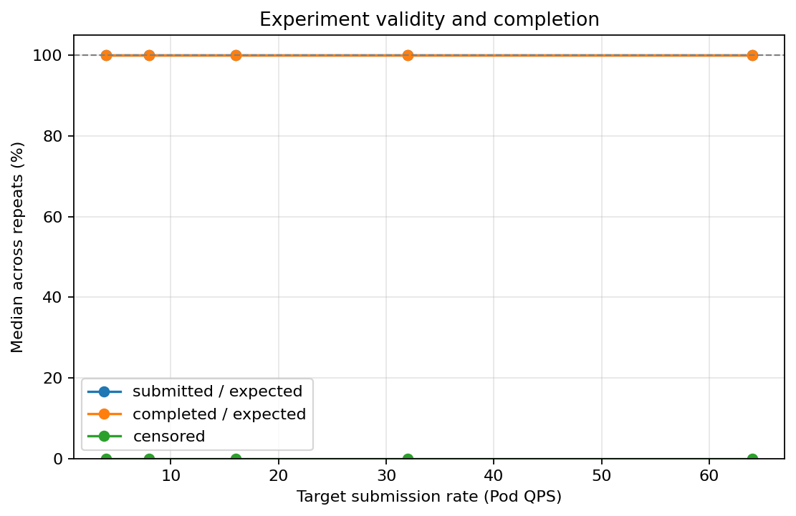
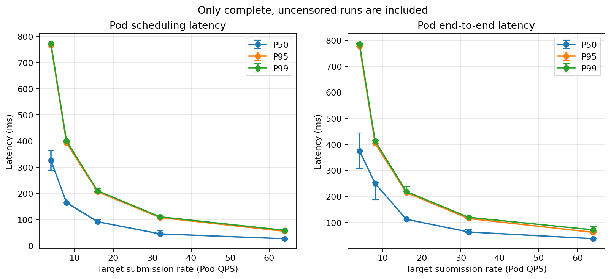
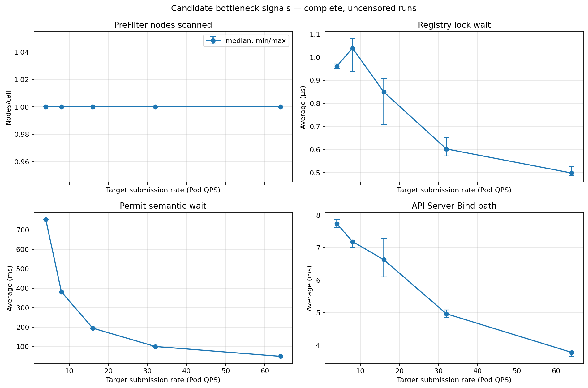
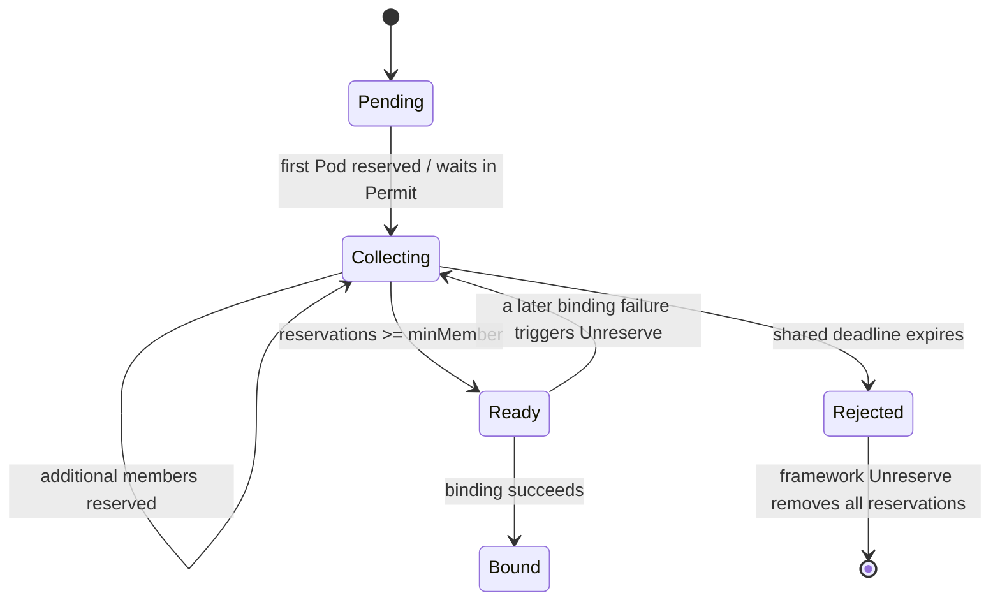

# Day 05 — Topology-Aware Gang Scheduling Plugin

- **Date:** 2026-07-27
- **Planned deliverable:** A working TopoGang scheduler plugin with whole-group admission, topology-aware scoring, and a Permit barrier.
- **Core module:** `pkg/scheduler/plugins/topogang`
- **Status:** Core implementation and a live KWOK gang/profiler smoke are complete;
  the controlled N/ρ/M profiling matrix and default-scheduler comparison remain.

## Goals

- [x] Understand the scheduler framework extension points used by TopoGang.
- [x] Implement PreFilter gang membership and whole-group GPU capacity checks.
- [x] Implement per-node GPU filtering.
- [x] Implement topology-aware Score and score normalization.
- [x] Implement idempotent Reserve/Unreserve bookkeeping.
- [x] Implement Permit Wait/Allow and group timeout rejection.
- [x] Protect cross-Pod state against concurrent binding cycles.
- [x] Run package tests with the Go race detector.
- [x] Exercise Permit callbacks with framework-compatible waiting Pods.
- [ ] Run the KWOK default-scheduler versus TopoGang comparison.
- [x] Verify timeout rejection, Unreserve, and clean-attempt requeue in a race-tested
  integration-style unit test.
- [ ] Verify the same timeout/requeue path from live scheduler and Pod events.
- [x] Run a live KWOK `minMember=4` smoke with 19 complete gangs released and one
  deliberately incomplete tail gang rejected after the Permit timeout.
- [x] Add gang-aware load generation, group-level profiling, and TopoGang diagnostic
  metrics for Exp2 controlled-load phase.

## Concepts I Clarified

### Grove and gang scheduling

Grove is a Kubernetes orchestration system for distributed AI inference workloads. Gang scheduling is one of its core capabilities, but Grove also addresses hierarchical gangs, topology-aware placement, coordinated scaling, startup ordering, and workload lifecycle management.

This project implements a deliberately smaller idea:

```text
Pod labels + minMember + topology Score + Permit Wait/Allow/Reject
```

It does not implement Grove's hierarchical workload model or production lifecycle controllers.

### Pod, Node, and metadata

`v1.Pod` and `v1.Node` are the Go representations of Kubernetes API objects. `ObjectMeta` is embedded in both types, which is why fields such as the following can be accessed directly:

```text
pod.Labels
pod.Namespace
pod.UID
node.Labels
```

The fake Node YAML must follow the `core/v1 Node` API shape. Its important inputs to this plugin are:

```text
status.allocatable["nvidia.com/gpu"]
metadata.labels["topology.nvidia.com/nvlink-domain"]
```

The `nvidia.com/gpu.count` label is only metadata. The scheduler performs resource accounting with `status.allocatable["nvidia.com/gpu"]`.

The repository maintains one parameterized Node template. `scripts/spawn-nodes.sh` replaces the node, domain, and zone placeholders and submits the generated Nodes to the API server for KWOK to simulate.

### CycleState, PreFilterState, and Registry

These structures have different scopes:

| Structure | Scope | Purpose |
| --- | --- | --- |
| `framework.CycleState` | One Pod, one scheduling attempt | Framework-owned temporary storage shared between extension points |
| `PreFilterState` | One TopoGang Pod, one scheduling attempt | Stores the parsed group UID, `minMember`, and the Pod GPU request |
| `Registry` | All Pods handled by one TopoGang plugin instance | Stores cross-Pod gang reservations, topology placement, deadline, and state |

The simplest mental model is:

```text
PreFilterState describes "this Pod".
Registry describes "the whole gang".
CycleState is the temporary container holding this Pod's state.
```

`CycleState` cannot store the gang's reservation count because every Pod has a different CycleState. The plugin-level Registry is required for members of the same gang to observe one another.

### Filter does not allocate GPUs

Filter only answers whether the current Pod can fit on one candidate node:

```text
free GPU = allocatable GPU - requested GPU
free GPU >= current Pod GPU request
```

Filter does not mutate NodeInfo, allocate a physical GPU, or create a gang reservation. The kube-scheduler cache performs assumed-resource accounting after selecting a node. TopoGang's Reserve hook separately records gang membership and topology placement.

Pods in one gang do not share one GPU. Each Pod requests and occupies its own GPU resources. Gang scheduling coordinates admission so enough members receive their own resources before the workload is released.

## Design

### Scheduling flow

```text
PreFilter
  Parse and validate gang labels
  Compute this Pod's GPU request
  Store PreFilterState in CycleState
  Check whether the gang can plausibly reach minMember
        |
        v
Filter(candidate node)
  Check this Pod's GPU request against NodeInfo
        |
        v
Score(candidate node)
  Read how many group members are already in the node's NVLink domain
        |
        v
NormalizeScore
  Map raw placement counts to [0, 100]
        |
        v
Scheduler chooses and assumes a node
        |
        v
Reserve
  Add a Pod-UID-keyed reservation to the Registry
        |
        v
Permit
  reserved < minMember  -> Wait
  reserved >= minMember -> Allow waiting siblings
  deadline reached      -> Reject the group
        |
        v
Unreserve on failure
  Remove the reservation idempotently
```

### Topology is a soft preference

The current implementation does not hard-lock a gang to the first observed NVLink domain. A hard constraint would require PreFilter to prove that one domain can hold the entire group and would need a domain-selection and fallback protocol.

Instead:

```text
Filter: enforce per-Pod capacity only
Score: prefer domains containing more members of the same gang
```

This preserves schedulability when one domain cannot contain the entire gang.

### Whole-group capacity check

PreFilter reads the scheduler's NodeInfo snapshot:

```text
NodeInfo.Allocatable.ScalarResources["nvidia.com/gpu"]
NodeInfo.Requested.ScalarResources["nvidia.com/gpu"]
```

`Requested` includes assumed Pods, which prevents double booking.

The check is shape-aware rather than using only aggregate free GPUs:

```text
members fitting on a node = free GPU on node / GPU request per Pod
```

This catches fragmentation such as two nodes with one free GPU each when every Pod requires two GPUs.

The result remains advisory because the snapshot can become stale and capacity alone does not prove that affinity, volumes, taints, or every other scheduling constraint can be satisfied.

### Pod-level reservations

The first design used only an integer `Assigned` count. That cannot make Unreserve idempotent: releasing the same Pod twice could incorrectly decrement another member's count.

The corrected source of truth is:

```text
map[types.UID]PodReservation
```

Each record stores:

```text
Pod UID
node name
topology domain
reservation timestamp
```

The assigned member count is always `len(Reservations)`. Domain data is stored at Reserve time so Unreserve does not need to look up a Node that may have been deleted or relabeled.

Important invariants:

```text
One Pod UID has at most one reservation.
A duplicate identical Reserve is a no-op.
Unreserve of a missing Pod UID is a no-op.
Framework Allow/Reject callbacks are invoked without holding the Registry mutex.
```

### Permit and timeout behavior

Returning `Wait` does not block the main scheduling loop. It parks only the current Pod's binding while the scheduler continues processing other Pods.

When the `minMember`-th reservation reaches Permit, the plugin iterates over framework waiting Pods, selects siblings with the same namespace-qualified group UID, and calls `Allow(TopoGang)`.

The whole group shares one deadline. Only one waiter starts the timer. On expiration, the plugin marks the attempt Rejected and rejects all waiting siblings so the framework can invoke Unreserve.

`AttemptID` prevents an old timer from rejecting a newly created attempt that reuses the same group name.

### Ordinary non-gang Pods

In Kubernetes v1.30, a PreFilter `Skip` suppresses the coupled Filter and PreFilterExtensions, but it does not automatically suppress Score, Reserve, or Permit.

Therefore those extension points explicitly recognize ordinary non-gang Pods and return neutral success. A missing PreFilterState for a real gang Pod remains an internal error.

## Core Responsibility of Each Function

| Function | Most important responsibility |
| --- | --- |
| `New` | Parse configuration and construct one plugin instance with one shared Registry |
| `PreFilter` | Decide whether the gang can plausibly reach `minMember` before expensive node evaluation |
| `Filter` | Decide whether this Pod has enough GPU capacity on this candidate node |
| `Score` | Read the number of same-group placements in the candidate node's topology domain |
| `NormalizeScore` | Convert raw domain counts to the framework's legal `[0,100]` range |
| `Reserve` | Add one idempotent Pod-UID reservation after the scheduler has selected a node |
| `Unreserve` | Roll back that exact Pod reservation on any later failure |
| `Permit` | Enforce the `minMember` barrier with Wait, Allow, and timeout rejection |
| `Ensure` | Atomically find or create one group and reject conflicting `minMember` declarations |
| `Assign` | Record one distinct reserved Pod and update its domain count |
| `Release` | Remove one reservation using its stored domain information |
| `PlacedInDomain` | Return Score's topology-locality signal under the Registry lock |
| `DecidePermit` | Atomically choose Ready, Wait, or Rejected from current gang state |
| `RejectIfCollecting` | Reject only the still-collecting attempt that owns the expired timer |

## Implementation Completed

- Added validated `TopoGangArgs`:
  - `permitTimeout`
  - `topologyKey`
  - `gpuResourceName`
- Added strict PodGroup label parsing.
- Added namespace-qualified group UIDs.
- Added `PreFilterState` with `framework.StateData.Clone`.
- Added GPU request calculation for regular and init containers.
- Added shape-aware whole-group GPU capacity checking.
- Added per-node GPU Filter.
- Added topology-aware raw Score.
- Added NormalizeScore.
- Added Pod-UID-keyed reservations.
- Added idempotent Reserve/Unreserve.
- Added Registry-level Permit decisions.
- Added group deadline and stale-timer protection.
- Added waiting-group Allow and Reject operations.
- Kept ordinary Pods neutral across all enabled extension points.

## Tests and Validation

Completed:

```text
go test -race ./pkg/scheduler/plugins/topogang
go test ./pkg/...
go test ./cmd/scheduler
```

All completed successfully.

The tests currently cover:

- plugin argument defaults, decoding, and validation;
- non-gang Pod behavior;
- PodGroup label parsing and `minMember` validation;
- shape-aware GPU capacity checks;
- per-node GPU Filter success and rejection;
- concurrent Registry singleton creation;
- duplicate Reserve and repeated Unreserve idempotency;
- score normalization;
- Registry Permit Wait/Ready decisions;
- expired-group rejection;
- race detection for the exercised concurrent paths.

## 2026-07-29 Follow-up — Exp2 controlled-load phase Profiling Plumbing and Live Smoke

Today moved Day 5 from plugin-only validation to an end-to-end profiling path:

```text
loadgen creates labeled gang Pods
    → TopoGang schedules / waits / binds
    → profiler watches Pod transitions
    → per-Pod and per-gang CSVs
    → Scheduler /metrics exposes internal attribution signals
```

### Canonical `t_*` vocabulary

The profiling design now uses one time vocabulary instead of descriptions such as
"the scheduler is slow":

| Term | Meaning |
| --- | --- |
| `t_submit` | first gang member submitted → last gang member submitted |
| `t_queue` | member submitted → first active-queue pop |
| `t_cycle` | PreFilter + Filter + Score + Reserve for one attempt |
| `t_permit` | Reserve complete → Permit allows or rejects |
| `t_bind` | Permit allowed → binding observed |
| `t_ready` | first observed `spec.nodeName` → first observed `Ready=True` |
| `t_requeue` | failed-attempt backoff and queue re-entry |
| `t_group_ready` | first member submitted → all declared members Ready |

The current attribution hypotheses are:

```text
H1  t_cycle ↑ through t_prefilter ↑  — whole-cluster GPU scan
H2  t_cycle ↑ through t_score ↑      — Registry mutex contention
H3  t_permit ↑                       — expected gang barrier wait
H4  t_requeue ↑                      — reject/backoff/retry churn
H5  t_bind ↑                         — binding/apiserver path
H6  t_submit ↑ or invalid clocks     — the measurement tool is the bottleneck
```

### Exp2 profiling blockers implemented

The B0–B5 engineering prerequisites from
[`docs/experiments/exp2-topogang-load-profiling.md`](../../experiments/exp2-topogang-load-profiling.md)
now have code paths:

- **B0 — clocks:** `ScheduledTs`/`BoundTs` use the first client observation of
  `spec.nodeName`; `ReadyTs` uses the first client observation of `Ready=True`.
  Server-side condition timestamps remain diagnostic-only because their second-level
  precision produced negative kwok-speed intervals.
- **B1 — gang load:** loadgen accepts `--gang-size` and `--run-id`, emits
  `topogang.dev/pod-group`, `topogang.dev/min-member`, run, and member-index labels, and
  records group metadata in JSONL.
- **B2 — group aggregation:** profiler writes per-group timelines and summaries,
  including member count, `t_submit`, `t_group_ready`, submit attempts, and censoring.
- **B3 — diagnostic metrics:** the plugin registers
  `topogang_prefilter_nodes_scanned`,
  `topogang_registry_lock_wait_seconds`,
  `topogang_podgroup_wait_seconds{outcome}`,
  `topogang_gang_reject_total{reason}`, and
  `topogang_waiting_pods_iterated`.
- **B4 — runtime profiles:** the scheduler accepts mutex-profile fraction and
  block-profile rate flags.
- **B5 — contention:** `scripts/exp2-topogang-prefill.sh` computes filler demand for a target ρ
  and reports achieved ρ from bound filler Pods; it still needs a dedicated live
  validation run.

All affected Go packages passed:

```text
go test ./...
go vet ./...
go test -race ./pkg/...
```

The prefill script also passed `bash -n`.

### Metrics exposure clarified

`k8s.io/component-base/metrics` wraps Prometheus collectors with Kubernetes metric
registration and stability semantics. Registering a metric with
`legacyregistry.MustRegister` makes it available through the scheduler's existing
HTTPS `/metrics` handler; it does not configure Prometheus scraping.

For the local second scheduler, the working smoke command used a separate port and
explicit anonymous allow-list:

```bash
go run ./cmd/scheduler \
  --config config/scheduler/topogang-config.yaml \
  --secure-port 10260 \
  --bind-address 127.0.0.1 \
  --authorization-always-allow-paths=/metrics,/healthz
```

Kubernetes v1.30 kube-scheduler installs `/healthz`, not `/readyz`; therefore
`/healthz` returned `ok` while `/readyz` correctly returned 404. The macOS `/proc`
warning affects the process-start-time metric only, not scheduling.

Prometheus still needs a scrape target for this extra local scheduler. Until that is
wired, `curl -ks https://127.0.0.1:10260/metrics` verifies exposition but does not retain
per-run history.

### Measurement mistakes caught during the smoke

Several invalid runs were useful because each exposed a different experimental hazard:

1. `.../submit.jsonl` was copied literally; `...` is a placeholder, not a real path.
2. Reusing `run-id=smoke2` mixed old Pods and in-memory Registry state.
3. Rebuilding the kwok cluster without restarting the second scheduler left Pods
   unclaimed by the old scheduler connection.
4. `--run-id smoke4` with a `smoke3/submit.jsonl` path proved that the run ID controls
   Pod identity while `--out` controls only file placement.
5. Leaving old smoke4 Pods bound consumed all 160/160 simulated GPUs and made the next
   run look like a scheduler failure.
6. Running profiler and loadgen sequentially missed the lifecycle; profiler must already
   be watching while loadgen submits.
7. The original `ReadyTs` used the second-granularity `PodReady.LastTransitionTime`,
   producing negative cold-start intervals. Switching to first client observation fixed
   the clock invariant.

These failures justify the formal protocol's requirements: unique run IDs, a fresh or
fully cleaned cluster, scheduler restart, profiler-before-loadgen ordering, and per-run
metric snapshots.

### First valid live result: smoke6

The first clean end-to-end smoke used:

```text
N=20 nodes
8 GPUs/node
M=4
constant 4 Pod/s
20s load
20s drain
run-id=smoke6
```

Profiler accounting closed exactly:

```text
submitted=79
matched=79
unobserved=0
unsubmitted=0
complete Pods=76
censored Pods=3
complete gangs=19
censored gangs=1
negative intervals=0
```

The 76 complete Pods are 19 full four-member gangs. The final three Pods form one
incomplete gang; TopoGang left them pending, rejected them at the 30-second Permit
deadline, and requeued them.

Measured smoke6 values:

| Signal | P50 | P95 | P99 |
| --- | ---: | ---: | ---: |
| `t_submit` | 753.083 ms | 759.113 ms | 759.113 ms |
| `t_group_ready` | 774.559 ms | 797.541 ms | 797.541 ms |
| Pod scheduling | 278.550 ms | 768.825 ms | 770.458 ms |
| `t_ready` / cold-start | 11.262 ms | 26.628 ms | 27.497 ms |
| Pod end-to-end | 296.786 ms | 781.799 ms | 794.236 ms |

Per-group `t_group_ready - t_submit` was approximately:

```text
P50=24.038 ms
P95=43.493 ms
mean=25.014 ms
```

This means about 750 ms of group-ready time came from submitting the four members at
4 Pod/s. Early members spent the same interval waiting at Permit; `t_submit` and
`t_permit` overlap and must not be added twice. After the final member was submitted,
the remaining scheduling/binding/watch/kwok-ready path took roughly 12–43 ms.

### Preliminary bottleneck reading

This is a smoke result, not the pre-registered scale experiment, but it supports a narrow
statement:

> At N=20, M=4, and low contention, group-ready time is dominated by the loadgen's
> intra-gang submission span and the corresponding semantic Permit wait. No
> implementation-level TopoGang bottleneck is visible.

The current scheduler process's cumulative metrics were also small for the suspected
implementation costs:

```text
TopoGang PreFilter mean ≈ 39 µs/call
nodes scanned mean      ≈ 8.2 of 20
Registry lock wait mean ≈ 3.4 µs/acquisition
allowed Permit mean     ≈ 750 ms
rejected Permit mean    ≈ 30 s
```

Those metrics include more than smoke6 because no before/after snapshots were saved, so
they are qualitative only. They do not prove H1 or H2 absent at N=500/1000 or ρ≈1.

### Follow-up required before formal Exp2 controlled-load run

- Use the implemented `--max-gangs` complete-gang stop; the earlier duration-only cutoff
  left a 3/4 tail gang, yielding 3.8% Pod and 5% gang censoring.
- Save `/metrics` immediately before and after every run, or wire the local scheduler
  into Prometheus, so attribution uses per-run deltas instead of process-lifetime totals.
- Run a fresh scheduler/cluster for each cell.
- Execute the planned N, ρ, and M sweeps plus the default-scheduler control.
- Treat `binding_ms=0` in the current profiler as a measurement-boundary artifact:
  `ScheduledTs` and `BoundTs` share the first observed `nodeName`; internal `t_bind`
  must come from scheduler/apiserver metrics.

The repeatable end-to-end check is now:

```bash
make exp2-topogang-smoke
```

[`scripts/exp2-topogang-smoke.sh`](../../../scripts/exp2-topogang-smoke.sh) chooses a unique run ID,
submits a fixed number of complete gangs, runs profiler and loadgen concurrently, saves
before/after scheduler metric snapshots, rejects missing/censored/negative samples, and
deletes only its own run-labeled Pods on exit.

## Controlled QPS Sweep After the Smoke Test

The first complete stepped-load batch was:

```text
batch:       exp2p-load-20260730-174540-96452
QPS:         4, 8, 16, 32, 64
repeats:     3
gang size:   4
gangs/run:   200
Pods/run:    800
GPU/Pod:     1
cluster GPU: 20 nodes × 64 GPU = 1280 allocatable GPU
```

Run `q4-r1` failed before load generation because nothing was listening on
`127.0.0.1:10260` when the batch preflight called the TopoGang health endpoint. It
submitted zero Pods and is an infrastructure-invalid run, not a performance failure.
The scheduler was then started and the remaining 14 runs passed. This exposed a harness
issue: a missing scheduler should fail the entire batch once, rather than create a row
and continue.

Every valid run closed its measurement accounting:

```text
submitted=800
observed=800
censored=0
gang rejects=0
complete gangs=200
```

The Python analysis reads the batch `summary.csv` and each run's `groups.csv`.
`t_after_submit` is calculated per complete Gang as
`t_group_ready - t_submit` before taking quantiles; it is not calculated by subtracting
two independently summarized quantiles.

Median results across valid repeats were:

| Target QPS | Valid runs | Scheduling P95 | `t_after_submit` P95 | Permit mean | Registry lock mean | Bind mean |
| ---: | ---: | ---: | ---: | ---: | ---: | ---: |
| 4 | 2 | 766.68 ms | 29.06 ms | 753.28 ms | 0.96 µs | 7.74 ms |
| 8 | 3 | 393.32 ms | 31.04 ms | 380.77 ms | 1.04 µs | 7.18 ms |
| 16 | 3 | 206.31 ms | 24.58 ms | 194.47 ms | 0.85 µs | 6.63 ms |
| 32 | 3 | 108.17 ms | 18.74 ms | 99.86 ms | 0.60 µs | 4.96 ms |
| 64 | 3 | 55.65 ms | 15.98 ms | 49.38 ms | 0.50 µs | 3.77 ms |

### QPS sweep figures



**Figure 1 — Run validity and completion.** The median submitted and completed ratios
were 100%, and censoring was zero at every QPS. At QPS 4, the plot summarizes the two
valid repeats; `q4-r1` was excluded because the scheduler endpoint was unavailable and
the run submitted zero Pods.



**Figure 2 — Pod scheduling and end-to-end latency.** Both curves fall as QPS rises
because the four members of each Gang arrive closer together. The downward slope is
therefore dominated by Permit barrier semantics, not evidence that additional load
improves scheduler execution.


**Figure 3 — Gang latency after the final member is submitted.** This removes the
intentional intra-gang arrival span. P95 stays in a narrow 16–31 ms range; P99 is
noisier but does not show a monotonic saturation knee through 64 QPS. Error bars show
the observed min/max across repeats.



**Figure 4 — Candidate bottleneck signals.** PreFilter inspected one node per call,
Registry lock wait remained around or below 1 µs, and neither Bind nor lock wait grew
with offered load. Permit wait follows approximately `3/QPS`, confirming that it is
primarily the expected wait for the other three Gang members.

### Interpretation

Scheduling P95 decreased as target QPS increased. This does not mean that load made the
scheduler faster. With four members submitted sequentially, the expected intra-gang
arrival span is approximately:

```text
(gang size - 1) / QPS = 3 / QPS
```

That predicts 750, 375, 187.5, 93.75, and 46.875 ms. The observed Permit means track
those values closely. The dominant scheduling interval in this sweep was therefore the
intentional Gang barrier waiting for loadgen to submit the remaining members.

No tested level showed a throughput breakpoint:

- all 14 valid runs completed 800/800 Pods;
- censoring and Gang rejection stayed at zero;
- exact post-submit Gang P95 stayed between about 16 and 31 ms;
- Registry lock wait remained sub-1.1 µs on average and did not grow with QPS;
- Bind mean did not grow with QPS.

The strongest defensible result is:

> In the 20-node, 1280-GPU KWOK configuration, TopoGang sustained the offered load
> through 64 Pod/s with complete accounting and no measured saturation. The sweep did
> not reach a bottleneck.

This does **not** prove that the proposed bottlenecks are absent. In particular,
`prefilter_nodes_avg=1` at every level. Increasing each simulated node from 8 to 64 GPU
removed the capacity failure but also made the whole-group capacity check terminate
after one node, so this sweep did not exercise the proposed `O(P·N)` scan. It also did
not vary node count, occupancy, or Gang size, and it records per-run metric deltas rather
than CPU/queue time series.

### Required next experiments

1. Increase offered load beyond 64 QPS (`128`, `256`, then `512`) until completion,
   tail latency, or actual throughput shows a knee.
2. Separate arrival semantics from scheduler work by either submitting each Gang as a
   burst or treating per-Gang `t_after_submit` as the primary latency.
3. Run a node-count sweep and a high-occupancy sweep so PreFilter must inspect many
   nodes; verify `prefilter_nodes_avg` changes before testing H1.
4. Increase Gang size and concurrent waiting gangs independently to stress Permit
   iteration and Registry contention.
5. Add a batch-level scheduler preflight so an unavailable `:10260` endpoint aborts
   before the first matrix row.

Offline artifacts are generated with:

```bash
MPLCONFIGDIR=/private/tmp/gpu-fleet-matplotlib-cache \
conda run -n dsci552 \
python analysis/analyze_exp2.py \
  --input experiments/exp2-topogang/controlled-load/published/exp2p-load-20260730-174540-96452
```

The generated `aggregate.csv`, plots, and `report.md` live under
`analysis/exp2/exp2p-load-20260730-174540-96452/` and are intentionally ignored by Git.

## What I Learned

- Filter can be individually cheap but becomes expensive when multiplied by thousands of candidate nodes.
- PreFilter is useful both for early rejection and for computing data once for later extension points.
- Scheduler cache assumption and plugin reservation are separate concepts:
  - scheduler cache assumption protects resource accounting;
  - TopoGang reservation tracks gang membership and topology.
- Permit Wait is asynchronous with respect to the main scheduling loop.
- A timeout for one waiting Pod is not automatically a whole-gang rejection.
- A count alone is insufficient for idempotent rollback; reservations need Pod identity.
- Returning internal pointers after releasing a Registry lock invites races, so extension points should consume immutable snapshots.
- The race detector checks only concurrency paths that tests actually execute; passing `-race` is evidence, not a proof of all possible correctness.

## Known Limitations

- The whole-group PreFilter model currently covers GPU capacity only.
- It assumes gang members have the same GPU request as the currently scheduled Pod.
- CPU, memory, taints, affinities, volumes, and other constraints are enforced per Pod by default scheduler plugins.
- Topology is a soft preference, not a hard all-members-in-one-domain guarantee.
- Permit provides a barrier, not transactional atomic binding; individual Bind operations may still fail after release.
- Successful bindings and terminated Pods are not yet removed through PostBind or informer-based lifecycle cleanup.
- The Registry is in memory and is lost when the scheduler process restarts.
- Framework-compatible waiting-Pod tests cover Permit callbacks, and smoke6 observed the
  live timeout/requeue path. Per-group scheduling-attempt counts still come only from
  aggregate framework metrics, not the profiler CSV.

## Remaining Day 5 Work

- [x] Build an integration-style framework-compatible test that exercises waiting-Pod callbacks.
- [x] Prove the Permit state transition and whole-group waiting-Pod callback behavior.
- [x] Prove in race-tested plugin tests that timeout rejects siblings and a new attempt
  can be created after Unreserve.
- [x] Run a live KWOK scenario with `minMember=4`; smoke6 completed 19 full gangs and
  observed timeout/requeue for the final three-member group.

### Exp2 preview command

Run the custom scheduler in one terminal, then run:

```bash
make exp2-topogang-preview
```

The script creates one disposable 3-GPU KWOK node and two four-Pod variants. Every Pod
requests one GPU and declares `minMember=4`. It asserts:

```text
default-scheduler: 3/4 Pods have spec.nodeName (partial occupancy)
topogang:          0/4 Pods have spec.nodeName (whole group remains pending)
```

The preview deliberately refuses to run if another node advertises GPU capacity, because
TopoGang's current PreFilter check is cluster-wide. It cleans up its namespace and node
on exit. This is a visual admission test, not yet the full Exp2 latency experiment.
- [ ] Compare default scheduler partial placement with TopoGang whole-group waiting/failure.
- [x] Capture Pod events and observed timeout/requeue behavior in smoke6.

## State Machine



## Plan for Day 6

First finish the real Permit and KWOK integration checks so Day 5 has evidence for all-or-nothing behavior. Then proceed to cold-start simulation and batching work without treating unverified scheduler behavior as complete.
